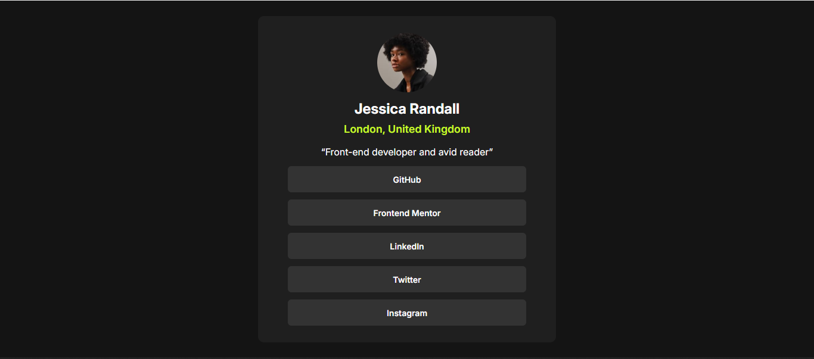

# Frontend Mentor - Social links profile solution

This is a solution to the [Social links profile challenge on Frontend Mentor](https://www.frontendmentor.io/challenges/social-links-profile-UG32l9m6dQ). Frontend Mentor challenges help you improve your coding skills by building realistic projects.

## Table of contents

- [Overview](#overview)
  - [The challenge](#the-challenge)
  - [Screenshot](#screenshot)
  - [Links](#links)
- [My process](#my-process)
  - [Built with](#built-with)
  - [What I learned](#what-i-learned)
  - [Useful resources](#useful-resources)
- [Author](#author)

## Overview

### The challenge

Users should be able to:

- See hover and focus states for all interactive elements on the page

### Screenshot



### Links

- Solution URL: [Add solution URL here](https://your-solution-url.com)
- Live Site URL: [Add live site URL here](https://your-live-site-url.com)

## My process

### Built with

- TailwindCSS
- Flexbox
- Mobile-first workflow
- [React](https://reactjs.org/) - JS library

### What I learned

I perfected my knowledge on how to map through array of objects

To see how you can add code snippets, see below:

```jsx
<ul className="flex flex-col gap-3">
  {links.map((link, index) => (
    <li
      key={index}
      className="bg-grey700 w-[80%] m-auto py-[10px] rounded-md cursor-pointer"
    >
      <a href={link.link} className="text-whitee text-[14px] font-semibold">
        {link.title}
      </a>
    </li>
  ))}
</ul>
```

### Useful resources

- [BroCode](https://youtube.com/@BroCodez) - This helped me for XYZ reason. I really liked this pattern and will use it going forward.
- [Hitesh Choudhary](https://youtube.com/@HiteshCodeLab) - This is an amazing article which helped me finally understand XYZ. I'd recommend it to anyone still learning this concept.

## Author

- Website - [LinkedIn](https://linkedin.com/in/olatilewaolatoye)
- Frontend Mentor - [@amnesia2k](https://www.frontendmentor.io/profile/amnesia2k)
- Twitter - [@kang_codes](https://x.com/kang_codes)


